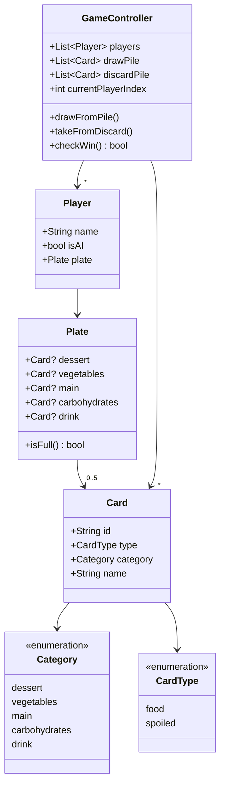
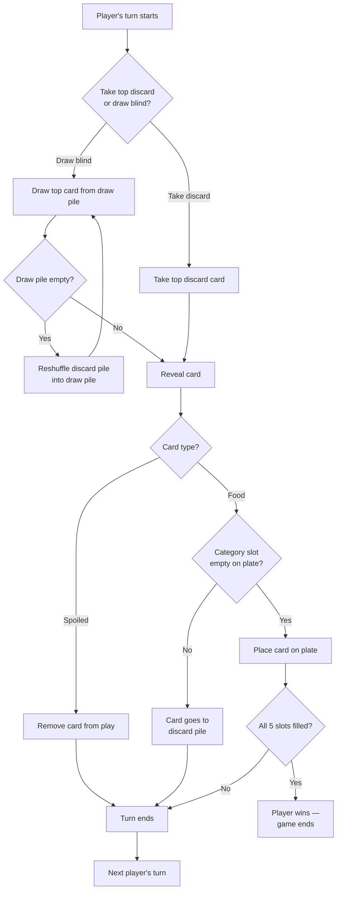
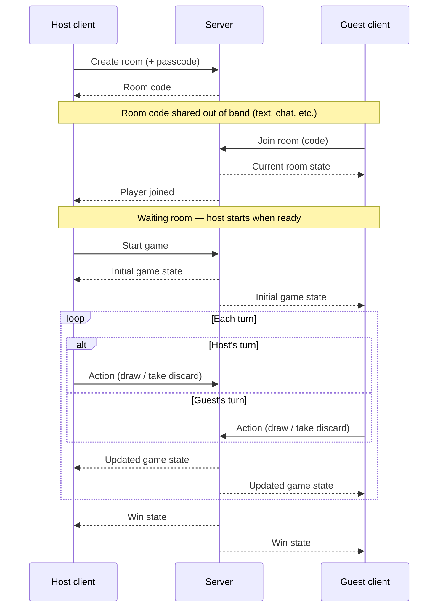

# Spoiled Supper — Digital Recreation: Specification & Issue Backlog

**Spoiled Supper** is a from-scratch Flutter recreation of the 1983 Orchard Toys /
Macdonald 345 card game *Tummy Ache*. Ships as a web app first, designed for
desktop screen sizes, with a mobile-responsive PWA in v1.1, computer opponents
in v1.2, and native desktop/mobile app builds in v1.3. Open source (MIT).

---

## 1. Overview

Players race to build a complete meal on their place-setting board (Main, Drink,
two Sides, Dessert) by drawing cards from a shared pile, while avoiding — or
laughing at — the "Spoiled" cards mixed into the deck.

**Roadmap:**
- **v1.0** — Pass & Play (2–4 players, one device) — Web (desktop screen sizes)
- **v1.1** — Mobile-responsive PWA
- **v1.2** — Computer opponents
- **v1.3** — Native platform builds (Android, Windows/Linux desktop)
- **v1.4** — Online multiplayer

---

## 2. Key Decisions (recap)

| Area                    | Decision                                                                                                                                                                                                                                                                                                                                                                                                                                                                                                                                                                                                                                                                                                                                                                                                                                                                       |
|-------------------------|--------------------------------------------------------------------------------------------------------------------------------------------------------------------------------------------------------------------------------------------------------------------------------------------------------------------------------------------------------------------------------------------------------------------------------------------------------------------------------------------------------------------------------------------------------------------------------------------------------------------------------------------------------------------------------------------------------------------------------------------------------------------------------------------------------------------------------------------------------------------------------|
| Framework               | Flutter (single codebase → Web, Android, Windows/Linux desktop; mobile-responsive PWA in v1.1, native desktop/Android app builds in v1.3). iOS and macOS are **out of scope** — both require a Mac (via Xcode) plus a paid Apple Developer account for iOS distribution. iOS users are still served by the v1.1 PWA via Safari's "Add to Home Screen," which needs neither                                                                                                                                                                                                                                                                                                                                                                                                                                                                                                     |
| State management        | Top-level `StatefulWidget` + `InheritedWidget` (no external package)                                                                                                                                                                                                                                                                                                                                                                                                                                                                                                                                                                                                                                                                                                                                                                                                           |
| License                 | MIT                                                                                                                                                                                                                                                                                                                                                                                                                                                                                                                                                                                                                                                                                                                                                                                                                                                                            |
| Card art                | Original placeholder assets shipped in repo (text + colour-coded cards). Users may optionally supply their own locally-sourced images (from their own physical copy) via a local override system — never bundled, synced, or shared in-app                                                                                                                                                                                                                                                                                                                                                                                                                                                                                                                                                                                                                                     |
| Card data source        | **Confirmed** (categories, counts, items) against the maintainer's physical 1983 copy — see Appendix A. The physical cards show only images with no printed text; card names are entirely the maintainer's own original descriptions of the imagery                                                                                                                                                                                                                                                                                                                                                                                                                                                                                                                                                                                                                            |
| Online architecture     | Dart monorepo: shared `game_engine` package used by both the Flutter client and a lightweight self-hosted Dart WebSocket server (`shelf` + `web_socket_channel`)                                                                                                                                                                                                                                                                                                                                                                                                                                                                                                                                                                                                                                                                                                               |
| Server hosting          | No committed/default server — each deployer hosts their own instance wherever suits them (home server, Fly.io, Cloud Run, VPS, etc.). README documents multiple options, endorses none as "the" server                                                                                                                                                                                                                                                                                                                                                                                                                                                                                                                                                                                                                                                                         |
| Server address (client) | Configured at **runtime**, not build-time — first-launch prompt, persisted locally, editable in settings. Required for app-store distribution (one binary, many possible servers) and lets a user connect to different groups' servers without reinstalling                                                                                                                                                                                                                                                                                                                                                                                                                                                                                                                                                                                                                    |
| Access control          | Shared passcode (env-configured secret) required to *create* a room; joining an existing room by code stays open. Gates hosting, not play — each self-hosted instance sets its own passcode independently                                                                                                                                                                                                                                                                                                                                                                                                                                                                                                                                                                                                                                                                      |
| Typography              | **Caprasimo** (Google Fonts) reserved for a small, fixed set of big, short, dramatic moments — the home-screen title, the win-screen headline, and the Spoiled reveal callout. **Fredoka** (Google Fonts) for everything else — card labels, buttons, selectors, turn banner, action log, settings text. Caprasimo is a single-weight decorative display face (no lighter cut exists), so it isn't suited to body/UI text; Fredoka carries that role throughout for a consistent, legible voice. Chosen over Baloo 2 since Baloo 2 is the Devanagari member of a ten-script family with Latin as a secondary pairing — Fredoka is Latin-first, more appropriate for an all-English game. Both freely licensed; typeface choice carries no copyright risk on its own (the earlier copyright concern was about not copying Orchard Toys' logo/wordmark, not typefaces generally) |

**Typography mapping (Flutter `TextTheme`):** all three `display` roles use
Caprasimo, each tied to one specific moment — `displayLarge` (home-screen title),
`displayMedium` (win-screen headline), `displaySmall` (Spoiled reveal
callout). Every other `TextTheme` role — `headlineLarge` through `labelSmall` —
uses Fredoka, including any persistent in-game header text (e.g. a "Spoiled!"
banner shown throughout play uses Fredoka via `headlineLarge`, since it's a
constant screen fixture, not one of the three rare dramatic moments). Keep the
three `display` roles scoped to exactly those three moments — don't reach for
`displaySmall` elsewhere just for extra visual weight, or Caprasimo's impact
dilutes, and it starts competing with `headlineLarge`.

```
Caprasimo → displayLarge (title), displayMedium (win headline),
            displaySmall (Spoiled callout) — three fixed moments only
Fredoka   → everything else (headlineLarge/Medium/Small,
            titleLarge/Medium/Small, bodyLarge/Medium/Small,
            labelLarge/Medium/Small)
```

**Architecture note:** the repo should be structured as a monorepo from Epic 1
(even though online play is v1.4), so the rules engine is never tangled with UI
code and can be reused by the server later without a rewrite.

```
spoiled_supper/
├── packages/
│   └── game_engine/     # pure Dart: Card, Category, Player, GameController, rules
├── app/                 # Flutter client
├── server/              # Dart WebSocket server (added in v1.4)
└── README.md
```

---

## 3. Asset & Copyright Policy (for README)

- This repository contains **no** Orchard Toys / Macdonald 345 artwork, branding, or trademarks.
- Spoiled Supper is an independent, fan-made project and is not affiliated with, endorsed by, or sponsored by Orchard Toys or Macdonald 345.
- Default cards are original placeholders (plain background, category colour, food name as text).
- Card names used throughout this project are the maintainer's own original descriptions of imagery on the physical cards, not printed text from them — the physical cards display only images, with no text at all.
- Users may personally supply their own card images (e.g. photographed/scanned from a copy they own) by placing files in a local override folder. This is a personal, local-only feature — the app never uploads, syncs, or shares these files.
- Contributors must not submit copyrighted third-party art, scans, or trademarked assets to this repository.

---

## 4. Out of Scope / Non-Goals (v1.0 – v1.4)

These are deliberate exclusions from the current roadmap, not oversights — noted
here so they don't get silently proposed or half-built by a future contributor.
Any of these could be revisited, but that should be a deliberate scope decision,
not an assumption.

- **User accounts / authentication** — play is via room codes and a creation passcode only; no persistent player identity or login system is planned.
- **AI difficulty levels** — a single baseline strategy only (Epic 11). Difficulty tiers were considered and deliberately cut given how little strategic depth the game has to tier.
- **Spectator mode** — online multiplayer (v1.4) is participants-only.
- **In-game chat** — not part of the v1.4 online multiplayer MVP scope.
- **Reconnection / session resume** — v1.4 disconnect handling is intentionally basic (detect and notify only); resuming a dropped player's session mid-game is not planned.
- **Native iOS / macOS builds** — excluded from v1.3's native platform builds (both require a Mac to build on; iOS also needs a paid Apple Developer account). iOS is still reachable via the v1.1 PWA.
- **A centrally hosted "official" server** — by design, no default or maintainer-run server is bundled or pointed to; every deployer (including the maintainer) self-hosts their own instance.

---

## 5. Issue Backlog

### PHASE 1 — v1.0: Pass & Play MVP

#### Epic 1: Project Setup & Tooling
- [ ] **1.1** Scaffold monorepo structure (`packages/game_engine`, `app/`)
- [ ] **1.2** Initialise Flutter project targeting web only (designed for desktop screen sizes) — mobile-responsive PWA support added in v1.1 (Epic 10, reaches iOS via Safari); native desktop (Windows/Linux) and Android app builds added in v1.3 (Epic 14). iOS/macOS native builds out of scope (require a Mac and paid Apple Developer account)
- [ ] **1.3** Add MIT `LICENSE` file
- [ ] **1.4** Write initial `README.md` (project overview, asset/copyright policy, setup instructions)
- [ ] **1.5** Configure lint rules (`analysis_options.yaml`)
- [ ] **1.6** Set up GitHub Actions CI: build + `flutter test` on push/PR
- [ ] **1.7** Add `.gitignore` (Flutter/Dart standard and local asset-override folder)
- [ ] **1.8** Define `ThemeData.textTheme`: Caprasimo on all three `display` roles (`displayLarge`/`Medium`/`Small`), Fredoka on all other roles (see Typography mapping in Section 2)

#### Epic 2: Game Data Model (`game_engine` package)
- [ ] **2.1** ~~Confirm real card list/categories/counts against physical 1983 copy~~ — done, see Appendix A
- [ ] **2.2** Define `Category` enum: `dessert`, `vegetables`, `main`, `carbohydrates`, `drink` — see Appendix A note on naming (these two categories were shorthanded as "Left Side"/"Right Side" during specification discussion, describing board position, not printed box text; engine and UI use food-type names since the underlying card split is consistently veg vs. carb)
- [ ] **2.3** Define `Card` model (id, type [food/spoiled], category, name) — category applies to **both** card types per Appendix A (Spoiled cards are categorised 2-per-category, same as food cards)
- [ ] **2.4** Define `Player` and `Plate` models
- [ ] **2.5** Implement deck builder (constructs full 30-card deck from Appendix A data)
- [ ] **2.6** Implement Fisher–Yates shuffle utility
- [ ] **2.7** Unit tests: deck composition matches Appendix A exactly (20 food + 10 Spoiled, correct category distribution), uniqueness, shuffle distribution sanity check

**Data model:**



#### Epic 3: Core Game Engine
- [ ] **3.1** `GameController`: holds players, draw pile, discard pile, current turn
- [ ] **3.2** Draw-from-pile logic
- [ ] **3.3** Take-from-discard logic
- [ ] **3.4** Blocked-category handling (card discarded if slot already filled)
- [ ] **3.5** Spoiled card handling (removed from play, turn passes)
- [ ] **3.6** Pile-empty reshuffle-from-discard logic
- [ ] **3.7** Win detection (plate fully filled)
- [ ] **3.8** Turn advancement logic
- [ ] **3.9** Expose engine state via `InheritedWidget` wrapper for the UI layer
- [ ] **3.10** Unit tests covering all rule branches above (incl. edge cases: last card drawn, simultaneous-fill edge case)

**Turn flow:**



#### Epic 4: Placeholder Asset System
- [ ] **4.1** Design default placeholder card widget (colour-coded by category, food name as text in Fredoka)
- [ ] **4.2** Define asset-slot registry (maps card ID → expected local override filename)
- [ ] **4.3** Implement local override loader (checks user-specified folder/file picker, falls back to placeholder)
- [ ] **4.4** Document override system usage in README

#### Epic 5: Setup & Menu UI
- [ ] **5.1** Home/title screen (Caprasimo for the game title only; Fredoka for all other text)
- [ ] **5.2** Player-count selector (2–4, Pass & Play only for v1) — Fredoka
- [ ] **5.3** Player naming (optional, default "Player 1" etc.) — Fredoka
- [ ] **5.4** Start-game transition

#### Epic 6: Game Board UI
- [ ] **6.1** Place-setting plate widget (drink/vegetables/carbohydrates/dessert/main layout)
- [ ] **6.2** Draw pile widget (tappable, shows remaining count)
- [ ] **6.3** Discard pile widget (tappable to take the top card)
- [ ] **6.4** Turn banner / current-player indicator — Fredoka
- [ ] **6.5** Card reveal animation
- [ ] **6.6** Spoiled reveal animation (shake and callout, Caprasimo via `displaySmall`)
- [ ] **6.7** Card-to-plate placement animation
- [ ] **6.8** Card-to-discard animation (blocked category)
- [ ] **6.9** Responsive layout: desktop/web breakpoints (large screen sizes only for v1.0 — phone/tablet breakpoints added in v1.1, Epic 10)
- [ ] **6.10** Action log (recent-events feed) — Fredoka

#### Epic 7: End Game
- [ ] **7.1** Win screen (winner announcement in Caprasimo; supporting text in Fredoka)
- [ ] **7.2** Play-again flow (reset engine, return to set up)

#### Epic 8: Web Packaging
- [ ] **8.1** Web build config and deployment target (e.g. GitHub Pages)
- [ ] **8.2** App icon (original design) + splash screen

#### Epic 9: Testing & Polish
- [ ] **9.1** Widget tests for key screens (setup, board, win)
- [ ] **9.2** Manual QA checklist (all rule paths, desktop screen sizes in browser)
- [ ] **9.3** Accessibility pass (screen reader labels, colour contrast, tap-target sizes)
- [ ] **9.4** Performance check on web

---

### PHASE 2 — v1.1: Mobile-Responsive PWA

#### Epic 10: Mobile & PWA Support
- [ ] **10.1** Phone/tablet responsive breakpoints (extends Epic 6.9)
- [ ] **10.2** Touch-target sizing and interaction review for smaller screens
- [ ] **10.3** PWA manifest (name, icons, theme colour, display mode)
- [ ] **10.4** Service worker for offline capability and installability
- [ ] **10.5** App icon / splash adjustments for PWA install requirements
- [ ] **10.6** Manual QA on phone/tablet screen sizes in-browser, and as an installed PWA (incl. iOS Safari — PWA install needs neither a Mac nor an Apple Developer account, unlike native iOS builds)

---

### PHASE 3 — v1.2: Computer Opponents

#### Epic 11: AI Decision Engine
- [ ] **11.1** Define `AIStrategy` interface within `game_engine`
- [ ] **11.2** Implement baseline strategy: take discard if it fits an empty slot, else draw blind
- [ ] **11.3** Turn-delay/pacing so AI moves feel readable, not instant
- [ ] **11.4** Unit tests for AI decision logic

#### Epic 12: Menu & UI Updates
- [ ] **12.1** Add "vs Computer" mode to set up screen
- [ ] **12.2** Computer-opponent count selector (1–3)
- [ ] **12.3** Visual indicator distinguishing AI vs human players on-screen

#### Epic 13: Testing
- [ ] **13.1** Widget tests for vs-Computer setup flow
- [ ] **13.2** Full-game simulation tests (engine plays itself N times, asserts no invalid states/crashes)

---

### PHASE 4 — v1.3: Native Platform Builds

#### Epic 14: Native Platform Builds
- [ ] **14.1** Android build config (Play Store packaging)
- [ ] **14.2** Native desktop build config (Windows/Linux) — macOS excluded (requires a Mac to build on)
- [ ] **14.3** App icon / splash adjustments for native app store requirements
- [ ] **14.4** Manual QA on real Android devices, and native desktop builds on Windows/Linux

---

### PHASE 5 — v1.4: Online Multiplayer

**Room lifecycle & message flow** (spans Epics 15–18):



#### Epic 15: Server Scaffold
- [ ] **15.1** Initialise `server/` Dart project, depending on shared `game_engine` package
- [ ] **15.2** Set up `shelf` HTTP server + `web_socket_channel` upgrade handling
- [ ] **15.3** Define client↔server message protocol (JSON action/state messages)

#### Epic 16: Room & Session Management
- [ ] **16.1** Room creation (generates shareable short code)
- [ ] **16.2** Room join by code
- [ ] **16.3** Server-side authoritative `GameController` instance per room
- [ ] **16.4** Broadcast state updates to all connected clients in a room
- [ ] **16.5** Require shared passcode for room creation (env-configured secret, e.g. `ROOM_CREATE_PASSCODE`) — joining by code stays open, only creation is gated

#### Epic 17: Client Networking Layer
- [ ] **17.1** WebSocket client wrapper in Flutter app
- [ ] **17.2** Server address setting: first-launch prompt (no committed default), persisted locally (`shared_preferences`), editable later from a settings screen
- [ ] **17.3** Send player actions (draw/take-discard) to server
- [ ] **17.4** Receive and apply state updates from server
- [ ] **17.5** Swap local `GameController` usage for networked state when in online mode

#### Epic 18: Online Lobby UI
- [ ] **18.1** "Play Online" entry point on setup screen
- [ ] **18.2** Create-room screen (shows shareable code)
- [ ] **18.3** Join-room screen (code entry)
- [ ] **18.4** Waiting-room UI (shows connected players before start)

#### Epic 19: Disconnect Handling (MVP-level)
- [ ] **19.1** Detect client disconnect server-side
- [ ] **19.2** Basic UI messaging to remaining players ("Player X disconnected")
- [ ] **19.3** Graceful handling if host disconnects

#### Epic 20: Server Deployment
- [ ] **20.1** Containerise server (`Dockerfile`)
- [ ] **20.2** Document self-hosting steps in README (deployment options incl. home server and Fly.io/Cloud Run; reverse-proxy WebSocket upgrade config; `ROOM_CREATE_PASSCODE` setup)

#### Epic 21: Testing
- [ ] **21.1** Integration tests: multi-client connect/play through server
- [ ] **21.2** Manual QA across real network conditions (Wi-Fi, mobile data, latency)

---

## Appendix A: Confirmed Card List (source: physical 1983 copy)

30 cards total — 20 standard (food/drink) + 10 Spoiled, 4 and 2 per category respectively.
Categories, item counts, and which foods appear are confirmed against the maintainer's
physical copy. The physical cards display only images, with no printed text at all —
so the card names below are entirely the maintainer's own original descriptions of the
imagery, not a transcription of anything printed on the cards. Spelling/phrasing here
(e.g. British vs. American spelling) is purely a styling choice.

### Standard Cards (20)

| Category (engine/UI) | Cards                                               |
|----------------------|-----------------------------------------------------|
| Desserts             | Fruit Salad, Ice Cream, Jelly, Strawberries         |
| Vegetables           | Baked Beans, Carrots, Peas, Tomatoes                |
| Mains                | Fish Fingers, Lamb Chops, Sausages, Steak Pie       |
| Carbohydrates        | Baked Potato, Boiled Potatoes, Chips, Mashed Potato |
| Drinks               | Grape Soda, Milk, Orange Soda, Water                |

### Spoiled Cards (10)

| Category (engine/UI) | Cards                          |
|----------------------|--------------------------------|
| Desserts             | Apple Core, Banana Skin        |
| Vegetables           | Dandelions, Mouldy Lettuce     |
| Mains                | Fish Bone, Leather Boot        |
| Carbohydrates        | Mouldy Potato, Potato Peelings |
| Drinks               | Bug Soda, Pond Water           |

**Note on naming:** during specification discussion, these two categories were initially
described as "Left Side" / "Right Side" — this was the maintainer's own shorthand
for their position on the physical board, **not** the box's printed terminology.
The underlying card split is consistently vegetables vs. carbohydrate/potato
dishes (confirmed across both standard and Spoiled cards), so the engine and
UI use `vegetables` / `carbohydrates` as category names. This stays accurate
regardless of how a given screen size arranges the plate (e.g. stacked instead of
side-by-side on narrow phone layouts in v1.1).
